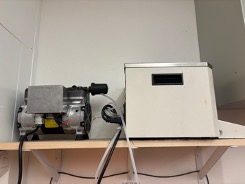
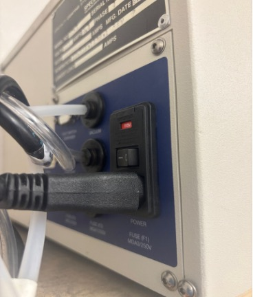
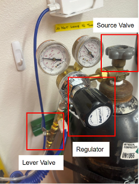

Standard Operating Procedure (SOP)  
Fort Lewis College  
Senior Seminar 2024-2025

**Author:** Ian Van Horn  
**Updated:** June 5, 2025

# Spin on Dopant (SOD) Process Guide

---

### ⚠️ Safety Notice
- **Certified BOE user required**
- **Wear goggles and proper PPE.**

---
## Materials
Dopant: Filmtronics B153  
Wafers:  
- 1 n-type 3-9 ohm cm for Spin on Dopant (SOD) control
- All wafers ready for processing
  
### Setup
1. **Hot plate** – start first to preheat  
    1. Clean the surface with proponal and a clean room wipe  
    2. Heat to 200&deg;C  

2. **Spin coater**  
    1. Ensure that both the vacuum pump and spin coater are plugged in and any power strip switches are on. The vacuum pump and spin coater are shown in Figure 1.  

        

           
          <em>Figure 1: Vacuum pump (left) and spin coater (right)</em>
        

    2. Turn on the spin coater via the switch on the back (Figure 2). The screen will not light up for now.  

        

           
          <em>Figure 2: Spin coater power switch</em>
        

    3. Turn lever valve that connects nitrogen to coater OFF. Ensure the nitrogen tank source is above 50 psi. The nitrogen tank is shown in Figure 3.  

        

           
          <em>Figure 3: Nitrogen tank and valves</em>
        

    4. Turn ON nitrogen with the source valve.  
    5. Turn the lever valve to ON position.  
    6. Adjust the psi to 20 on the regulator. If the spin coater does not turn on, slowly increase the psi until it does.  
    7. Click the spin time up arrow to view the parameters.  
    8. Adjust the settings to the following parameters:  
        - Acceleration time: 10 sec  
        - Speed time: 50 sec  
        - Spin speed: 2000 RPM  
        - Decel time: 0.5 sec  

3. **Native oxide removal**  
    1. Prepare a methanol bath with the beaker labeled with Ian’s name and fill it with enough methanol to cover the wafers in a boat.  
    2. Follow BOE SOP for setup. BOE in container labeled **“PMOS BOE FOX”** should be used. A quench of DI water should be prepared.  

### Procedure
1. Place clean N-type wafer on chuck
2. Use black alignment tool to center wafer
3. Do a practice run, wafer should have minimal “wobble”.
4. Get dopant ready
    1. Fill vial as much as possible
    2. Will dispense full dropper
5. Dispense dopant in center of wafer and IMMEDIATELY close door and start spinning.
    1. If the dopant sits on wafer it will create a line after the soft bake
6. After spin is complete, transfer wafer to hot plate
    1. ~200° for 12min (10-15min is recommended)
### Drive-in Procedure
Tube furnace: Ramp up and down same as Oxidation settings, just have to change the soak 
temperature and the running time from preceding/following temperatures. I’ve highlighted 
in blue what changed from oxidation.

- Turn **Main Power** switch to ON.
- Press  to display `C01` (current setting).
- This button,  will be used to go and see the next step of the heating curve.
- When adjusting the times, these buttons are used to change values up and down,    . To change certain values, use this button,  , to switch to different digits.
- Change t06 from 400 to 1 by using the buttons shown in steps above. This tells the controller to take one minute to go to the next step of the heating curve.
