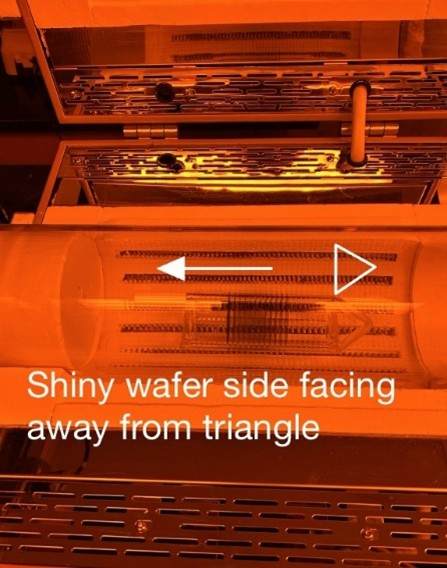
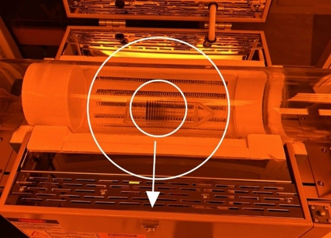
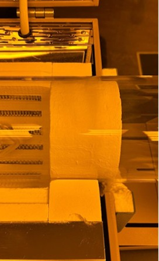
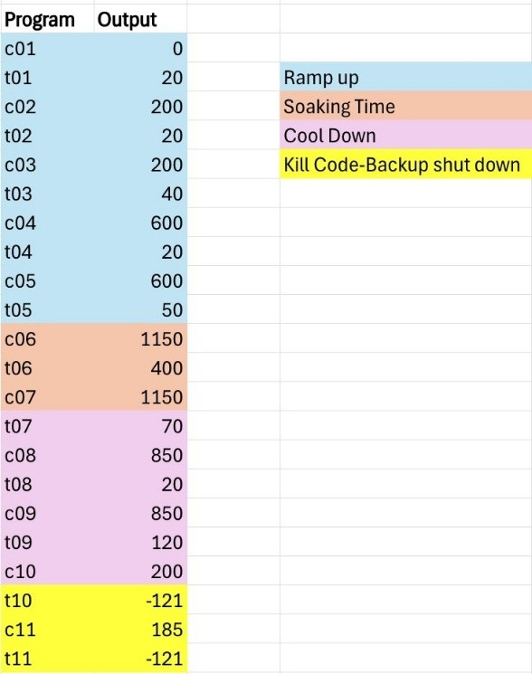
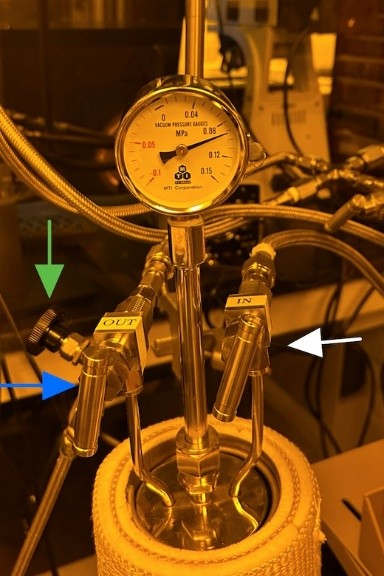
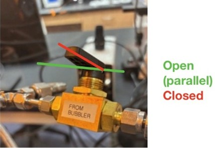
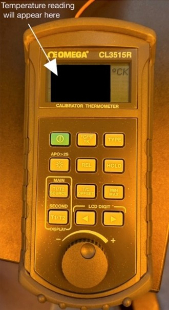

Standard Operating Procedure (SOP)  
Fort Lewis College  
Senior Seminar 2024-2025

**Author:** Natalia Lambos  
**Updated:** June 5, 2025

# Tube Furnace Oxidation Process Guide

---

### ⚠️ Safety Notice
- **Do not stand directly in front of the furnace during the process.**

---
## Unit Process SOP
1. **Preparation**

- Verify UHP oxygen and nitrogen tanks are full (>700 psi).
- Clean quartz boat with acetone, propanol, and methanol in the fume hood.
- Clean tube furnace and thermocouple with propanol using cleanroom wipes.
- Do not move the back thermal block.
- Place **Warning Furnace Sign** on Velcro at door.

2. **Wafer Loading**

- Load wafers into quartz boat, centered, regardless of count.
- Shiny side of wafers should face gas input (away from boat handle).
- Use **2 dummy wafers** to sandwich actual wafers, all facing shiny side toward gas input.
- Refer to _Figure 1_.

  
  
<strong>Figure 1:</strong> Wafer orientation

3. **Boat Insertion**

- Insert quartz boat so wafers line up with furnace door latch (see _Figure 2_).

  

  
  
<strong>Figure 2:</strong>Quartz boat alignment in tube furnace 

- Align thermal blocks with furnace insulation (see _Figure 3_).
  
  

  
  
<strong>Figure 3:</strong>Thermal block alignment 

- Slide the thermocouple through the metal blocks to ensure that it clears the wafers and does not hit them. 
- Close the lid on the furnace *SLOWLY*. If not, it can crush the tube. Secure latch. Put the metal grid from the oven on top of the furnace in preparation for the thermocouple.
- Put on metal cap cover and screw in on end of tube. 
image5.jpg, Picture, Picture

4. **Program Furnace Controller**

- Turn **Main Power** switch to ON.
- Press  to display `C01` (current setting).
- This button,  will be used to go and see the next step of the heating curve.
- When adjusting the times, these buttons are used to change values up and down,    . To change certain values, use this button,  , to switch to different digits.
- Change t06 from 400 to 1 by using the buttons shown in steps above. This tells the controller to take one minute to go to the next step of the heating curve.
- Ensure that the temperature c06 is at **1150 °C** for Dry-Wet-Dry oxidation.
- Adhere to the heating curve in _Figure 4_.

  

  
  
<strong>Figure 4:</strong>Field oxide heating curve 

5. **Bubbler Prepartion**

- Unscrew the bubbler using the black wrench. Dump out remaining water and wipe it down with Kimwipes.
- Fill the bubbler up 2/3 of the way, with 400 mL of DI water.(Use a graduated cylinder to measure.)
- Put the bubbler back in the sleeve. Ensure all valves going into and out of the bubbler are closed by turning all valves clockwise. These include the bypass valve (green arrow), the labeled inlet valve (white arrow), and the labeled outlet valve (blue arrow) in _Figure 5_.

  

  
  
<strong>Figure 5:</strong>Bubbler valves

- Ensure that the butterfly valve from the bubbler is open, _Figure 6_.

  

  
  
<strong>Figure 6:</strong>Butterfly valve connecting the bubbler to the furnace

---

## Oxidation Start

- Set mass flow rates to **20 SCCM** for both N₂ and O₂.
- Open nitrogen needle valve  with at least 2 turns counterclockwise.
- Turn N₂ butterfly valve  to ON.
- Press  button for a couple seconds until the word “run” appears on the controller.
- Press the green power button for two seconds until a loud clicking sound is heard and the red power light begins to blink. The blinking will not be consistent. The furnace is still on.
- The bubbler takes about 1 hour and 30 minutes to heat up and reach the required pressure of at least .085 MPa. So, start a 1 hour and 45 minutes timer and come back at that time to turn on the bubbler. 
- Also start a seperate 2.5 hours timer at the same time. This will be the timer for the ramp up.

---

## Bubbler Heating (1 hr 45 min into ramp)

- Turn ON bubbler power switch (under table).
- The temperature should be already set to **102°C**. Press and hold the down arrow until the program says “run”. The bubbler is now heating up.

---

## Checking Furnace Temperature (2.5 Hours After Ramp Start)

- After 2.5 hrs, plug thermocouple into **Omega Calibrator** (see _Figure 7_).
   
  

  
  
<strong>Figure 7:</strong>Omega Calibrator to verify furnace temperature

- Push the thermocouple through the metal lid and thermal block until the 2 scratches on the thermocouple are lined up with the end of the metal lid.
- Let the thermocouple sit for at least 3 minutes to ensure it reaches maximum temperature.
- **WARNING: the thermocouple will be glowing BRIGHT RED due to dangerous high temperature. It is very important to take EXTREME CARE not to hit any surface with the glowing rod when taking it out of the furnace.**
- When the thermocouple is pulled out, it will glow red, place it on top of the metal grid on top of the furnace.

---

## Dry Oxidation Phase (45 min)

- After verifying 1150°C, open **O₂ needle valve** (2 turns counterclockwise).
- Turn ON dry O₂ butterfly valve.
- Turn OFF N₂ butterfly valve and close N₂ needle valve.
- Set timer for **45 minutes**.

---

## Wet Oxidation Phase (2 hrs)

- Confirm bubbler pressure ≥ **0.085 MPa**.
- Open **bubbler bypass valve** (counterclockwise).
- Open **bubbler outlet valve**.
-  _Slowly_ turn ON **wet ox butterfly valve**.
- Turn OFF **dry ox valve**.
- Close **bubbler bypass**.
- Slowly open **bubbler inlet**. Water droplets in tube are normal.
- Set timer for **120 minutes**.

---

## Second Dry Oxidation(45 min)

- After 2 hrs:
   - Close bubbler outlet and inlet valves.
   - Open dry ox butterfly valve.
   - Close wet ox valve.
   - Turn OFF bubbler form the power switch.
- Set timer for 45 minutes.

---

## Cooldown

1. After 45 min, set `t06 = 1` minute.
2. Reopen **N₂ needle valve** and turn ON **N₂ butterfly valve**.
3. Turn OFF **dry O₂ valve** and close O₂ needle valve.
4. Go outside and turn OFF **UHP O₂**.
5. Set timer for **3.5 hrs** cooldown.

---

## Turn Off Furnace

- When furnace <400°C, turn off Main Power.
- Close N₂ needle valve and butterfly valve.
- Turn OFF UHP nitrogen tank.
